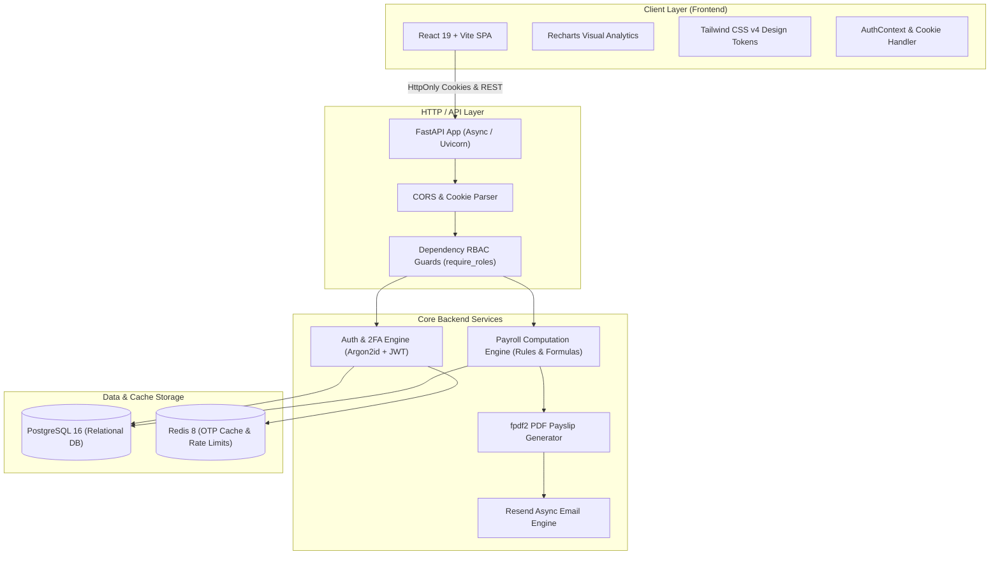

<div align="center">

# 💼 PeoplePay ERP — Next-Gen Workforce & Payroll Platform

### *Inspired by Odoo 18 — Engineered for Maximum Performance, Security, and Scalability*

<br/>

[](https://github.com)
[](https://github.com)
[](https://opensource.org/licenses/MIT)
[](https://github.com)

<br/>

<!-- Horizontal Colorful Technology Badges Row 1: Frontend -->
[](https://react.dev/)
[](https://vitejs.dev/)
[](https://tailwindcss.com/)
[](https://reactrouter.com/)
[](https://recharts.org/)
[](https://lucide.dev/)
[](https://oxc.rs/)

<br/>

<!-- Horizontal Colorful Technology Badges Row 2: Backend & Database -->
[](https://www.python.org/)
[](https://fastapi.tiangolo.com/)
[-D71F00?style=flat-square&logo=sqlalchemy&logoColor=white)](https://www.sqlalchemy.org/)
[](https://www.postgresql.org/)
[](https://redis.io/)
[](https://alembic.sqlalchemy.org/)
[](https://docs.astral.sh/uv/)

<br/>

<!-- Horizontal Colorful Technology Badges Row 3: Security & Services -->
[](https://github.com/P-H-C/phc-winner-argon2)
[](https://jwt.io/)
[](https://resend.com/)
[](https://py-pdf.github.io/fpdf2/)
[](https://www.docker.com/)

<p align="center">
  <b>A comprehensive, enterprise-ready Human Resource Management System (HRMS) and Payroll Engine designed to streamline employee lifecycles, dynamic time off allocations, multi-tier attendance records, complex salary rule calculations, batch payslip generation, and automated PDF delivery.</b>
</p>

</div>

---

## 📑 Table of Contents

- [Executive Summary](#-executive-summary)
- [System Architecture](#-system-architecture)
- [Key Features](#-key-features)
- [Tech Stack & Tooling](#-tech-stack--tooling)
- [Monorepo Directory Structure](#-monorepo-directory-structure)
- [Quick Start Guide](#-quick-start-guide)
  - [Prerequisites](#prerequisites)
  - [Backend Setup](#1-backend-setup)
  - [Frontend Setup](#2-frontend-setup)
  - [Running the Application](#3-running-the-application)
- [Rich Database Seeding](#-rich-database-seeding)
- [Default User Accounts & Credentials](#-default-user-accounts--credentials)
- [Role-Based Access Control (RBAC)](#-role-based-access-control-rbac)
- [Core API Routes Summary](#-core-api-routes-summary)
- [Security & Authentication Architecture](#-security--authentication-architecture)
- [Hackathon Attribution](#-hackathon-attribution)

---

## 🌟 Executive Summary

**PeoplePay** is built to replicate and enhance the core workflows of **Odoo HR & Payroll apps** in a modern, blazingly fast full-stack architecture. 

Unlike conventional toy projects, PeoplePay includes **over 14 months of realistic enterprise seed data** (Sep 2025 – Oct 2026), full mathematical payrun computations, progressive tax brackets, dynamic salary structures with rules, leave carry-forwards, daily attendance logging, and direct PDF email delivery.

---

## 🏛️ System Architecture



---

## 🚀 Key Features

### 👥 1. Employee Lifecycle & Directory
- Complete employee master data including personal info, private contact details, marital status, emergency contacts, identification, and bank account numbers.
- Department assignments with hierarchical manager structures.
- Direct linking between platform authentication accounts (`User`) and employee profiles (`Employee`).

### 📑 2. Contract & Compensation Management
- Full lifecycle contract states: `DRAFT`, `RUNNING`, `EXPIRED`, and `CANCELLED`.
- Flexible wage scheduling: Monthly, Hourly, and Custom rates.
- Working schedule assignments (Standard 40h, Part-time 20h, Flexible).
- Proactive contract expiry alerts for HR managers.

### ⏰ 3. Intelligent Attendance & Work Hour Tracking
- Real-time one-click check-in and check-out with automatic worked hours calculations.
- Overtime and late check-in detection.
- Managerial correction mode for missed punches or schedule adjustments.
- Complete employee timesheet histories.

### 🏖️ 4. Enterprise Time Off & Leave Quotas
- Configurable leave types (Paid Time Off, Sick Leave, Casual Leave, Compensatory Off, Unpaid Leave).
- Smart allocation management: Add and adjust quotas per employee without duplicate cards.
- Comprehensive request approval workflows (`SUBMITTED` ➔ `APPROVED` / `REFUSED`).
- Automatic allocation deduction upon approval.

### 💵 5. Precision Payroll & Payrun Engine
- **Payrun Lifecycle**: `DRAFT` ➔ `COMPUTING` ➔ `VALIDATED` ➔ `PAID`.
- **Dynamic Salary Structures & Rules**: Define base salaries, allowances (HRA, Conveyance, Medical, Retention), and deductions (Provident Fund, Professional Tax, TDS).
- **Rule Syntax Support**: Execute pythonic formulas evaluating `contract.wage`, `worked_days`, and custom multipliers.
- **Batch Processing**: Compute hundreds of payslips simultaneously in a single transaction.
- **PDF Generation**: Automatically render branded, pixel-perfect PDF payslips using `fpdf2`.
- **Email Delivery**: Instant batch dispatch of payslip PDFs to employee emails via `Resend`.

### 📊 6. Interactive Analytics & Dashboard
- Dynamic monthly payroll cost charts with multi-tier trend curves powered by `Recharts`.
- Department salary allocations and headcount breakdown.
- Real-time KPI summary widgets (active employees, monthly burn, pending leaves, expiring contracts).

---

## 🛠️ Tech Stack & Tooling

<div align="center">

| Domain | Technology / Library | Role / Purpose |
| :--- | :--- | :--- |
| **Frontend Framework** | **React 19** | Declarative modern UI component architecture |
| **Build Tool** | **Vite 6** | Lightning-fast HMR and optimized production bundles |
| **Styling** | **Tailwind CSS v4** | Modern utility-first CSS design system |
| **Routing** | **React Router v7** | Single Page Application (SPA) client-side routing |
| **Charts & Visuals** | **Recharts 3** | Responsive SVG/Canvas payroll and attendance analytics |
| **Icons** | **Lucide React** | Clean, accessible modern icon set |
| **Linter** | **Oxlint** | High-performance Rust-based JavaScript/JSX linter |
| **Backend Framework** | **FastAPI** | High-performance async Python web framework |
| **Runtime & Package Manager** | **Astral uv + Python 3.13** | Ultra-fast Python package and venv management |
| **ORM & Database** | **SQLAlchemy 2.0 (Async) + asyncpg** | Async relational mapping and PostgreSQL connectivity |
| **Database Migrations** | **Alembic** | Version-controlled declarative schema migrations |
| **Primary Database** | **PostgreSQL 16** | ACID-compliant enterprise relational database |
| **Cache & OTP Store** | **Redis 8** | High-speed cache for 2FA OTPs and rate limiting |
| **Password Security** | **Argon2id (`pwdlib`)** | Memory-hard password hashing (OWASP standard) |
| **Session Security** | **JWT via HttpOnly Cookies** | Secure token handling immune to XSS token theft |
| **PDF Generation** | **fpdf2** | High-fidelity payslip document generation |
| **Email Service** | **Resend (Async)** | Transactional email delivery for OTPs and payslips |
| **Containerization** | **Docker Compose** | Orchestration for local PostgreSQL & Redis services |

</div>

---

## 📂 Monorepo Directory Structure

```text
odoo-hackathon-final/
├── README.md                           # Master Project Documentation (You are here)
├── permission.txt                      # Detailed RBAC Permission Matrix Reference
├── docker-compose.yml                  # Postgres & Redis Container Config (in backend/)
│
├── backend/                            # FastAPI Python Backend Application
│   ├── README.md                       # Backend-specific architecture & API guide
│   ├── pyproject.toml                  # Python 3.13 & uv dependencies manifest
│   ├── uv.lock                         # Locked reproducible dependency tree
│   ├── alembic.ini                     # Alembic database migration configuration
│   ├── .env.example                    # Sample environment variables
│   ├── main.py                         # Application entrypoint & Redis lifespan
│   ├── seed.py                         # Enterprise 14-month seed dataset script
│   ├── migrations/                     # Alembic migration version files
│   └── app/
│       ├── core/                       # Config, database session, Redis, security, cookies
│       ├── models/                     # SQLAlchemy declarative models (10+ models)
│       ├── schemas/                    # Pydantic v2 validation & response schemas
│       ├── services/                   # Email (Resend) and PDF generator services
│       └── api/                        # Modular API controllers, routes, and RBAC deps
│           ├── deps.py                 # Token parsing & role-based route guards
│           ├── users/                  # Authentication, registration, OTP, user management
│           ├── employees/              # Employee CRUD & profile views
│           ├── departments/            # Department hierarchy management
│           ├── contracts/              # Contract tracking & wage configurations
│           ├── working_schedules/      # Work week schedules & shifts
│           ├── attendance/             # Check-in/out, logs, and adjustments
│           ├── time_off/               # Allocations, leave types, and requests
│           ├── payroll/                # Salary structures, rules, and dashboard metrics
│           └── payruns/                # Payrun compute engine, payslips, and PDF sender
│
└── frontend/                           # React 19 + Vite Single Page Application
    ├── README.md                       # Frontend-specific UI & component guide
    ├── package.json                    # Node dependencies and build scripts
    ├── vite.config.js                  # Vite configuration & backend proxy rules
    ├── index.html                      # HTML5 entry with Google Fonts
    └── src/
        ├── main.jsx                    # React DOM root render
        ├── App.jsx                     # Route definitions & public/protected route guards
        ├── index.css                   # Tailwind CSS v4 & custom design tokens
        ├── api/                        # Fetch/Axios client wrappers with credentials
        ├── context/                    # AuthContext (user session, login, logout)
        └── components/
            ├── Navbar.jsx              # Polished navigation bar with role switches
            ├── AuthCard.jsx            # Sleek login, register, and 2FA OTP modal
            ├── EmployeesPage.jsx       # Employee cards, table views, and editor
            ├── AttendancePage.jsx      # Time tracking and punches
            ├── TimeOffPage.jsx         # Leave allocations, requests, and calendar
            ├── PayrollPage.jsx         # Payruns, payslips, rules, and PDF viewer
            ├── admin/                  # User management & permission editor
            ├── contracts/              # Contracts list & salary structures
            └── employees/              # Department lists & working schedules
```

---

## ⚡ Quick Start Guide

### Prerequisites
Make sure you have the following installed on your machine:
- **Node.js** (v18.0.0 or later) & **npm**
- **Python 3.13** or [Astral uv](https://docs.astral.sh/uv/getting-started/installation/)
- **Docker Desktop** (for running PostgreSQL and Redis)

---

### 1. Backend Setup

Open a terminal and navigate to the backend directory:

```bash
cd backend
```

#### Install dependencies with uv:
```bash
# uv will automatically install Python 3.13 if not present and lock dependencies
uv sync
```

#### Configure Environment Variables:
```bash
cp .env.example .env
```
*(Optionally configure your `RESEND_API_KEY` in `.env` if you wish to test live email dispatch).*

#### Start Database & Cache Containers:
```bash
docker compose up -d
```

#### Apply Database Migrations:
```bash
uv run alembic upgrade head
```

#### Seed Enterprise Mock Data:
```bash
uv run python seed.py
```
> 💡 *This populates 20 users, 6 departments, 19 employees, 23 contracts, 14 monthly payruns (Sep 2025 – Oct 2026), 266 payslips with real monthly variance, 57 leave allocations, and daily attendance records.*

#### Start FastAPI Server:
```bash
uv run fastapi dev
```
The backend API is now running at `http://127.0.0.1:8000`. Interactive Swagger UI is available at `http://127.0.0.1:8000/docs`.

---

### 2. Frontend Setup

Open a new terminal and navigate to the frontend directory:

```bash
cd frontend
```

#### Install Node Packages:
```bash
npm install
```

#### Start Vite Development Server:
```bash
npm run dev
```
The frontend is now accessible at `http://localhost:5173`.

---

## 👥 Default User Accounts & Credentials

All seeded accounts share the same master password: **`Password123!`**

| Name | Role | Email | Access Scope |
| :--- | :--- | :--- | :--- |
| **Rajesh Sharma** | `admin` | `rajesh.sharma@oxptechnologies.com` | **Full System Access**: User management, system settings, all modules |
| **Priya Patel** | `hr_manager` | `priya.patel@oxptechnologies.com` | **HR Full Access**: Employees, departments, contracts, leaves, attendance |
| **Vikram Malhotra** | `hr_payroll_admin` | `vikram.malhotra@oxptechnologies.com` | **Payroll Full Access**: Salary structures, rules, compute payruns, delete payruns |
| **Sunita Rao** | `hr_payroll_user` | `sunita.rao@oxptechnologies.com` | **Payroll Operator**: View/compute payruns, validate, generate payslips |
| **Rohan Verma** | `employee` | `rohan.verma@oxptechnologies.com` | **Self-Service**: View own profile, punch attendance, request leaves, own payslips |
| **Ananya Iyer** | `employee` | `ananya.iyer@oxptechnologies.com` | **Self-Service**: View own profile, punch attendance, request leaves, own payslips |
| **Arjun Nair** | `employee` | `arjun.nair@oxptechnologies.com` | **Self-Service**: Senior backend engineer profile |

---

## 🔐 Role-Based Access Control (RBAC)

The platform enforces strict role-based access control across 5 tiers:

```
[Admin] > [HR Payroll Manager] > [HR Payroll User] > [HR Manager] > [Employee]
```

| Module / Feature | Employee | HR Manager | HR Payroll User | HR Payroll Manager | Admin |
| :--- | :---: | :---: | :---: | :---: | :---: |
| **Dashboard** | Own Stats | HR Metrics | Payroll + HR | Full Analytics | Full System |
| **Employee Profiles** | View Own | Full CRUD | Full CRUD | Full CRUD | Full CRUD |
| **Contracts** | ❌ | Full CRUD | Full CRUD | Full CRUD | Full CRUD |
| **Working Schedules** | ❌ | Full CRUD | Full CRUD | Full CRUD | Full CRUD |
| **Attendance** | Check-in / Own | View & Edit | View & Edit | View & Edit | Full CRUD |
| **Time Off Requests** | Request / Own | Approve/Refuse | Approve/Refuse | Approve/Refuse | Full CRUD |
| **Leave Allocations** | View Balance | Full CRUD | Full CRUD | Full CRUD | Full CRUD |
| **Salary Structures & Rules** | ❌ | ❌ | Read-Only | Full CRUD | Full CRUD |
| **Payrun Management** | ❌ | ❌ | Compute & Validate | Full CRUD | Full CRUD |
| **Payslips & PDF** | View Own | ❌ | Generate & Dispatch | Generate & Dispatch | Full CRUD |
| **User & Role Management**| ❌ | ❌ | ❌ | ❌ | Full CRUD |

---

## 📡 Core API Routes Summary

| Method | Endpoint | Access Level | Description |
| :--- | :--- | :--- | :--- |
| `POST` | `/auth/login` | Public | Authenticates credentials and sets HttpOnly secure JWT cookie |
| `POST` | `/auth/logout` | Authenticated | Clears the session cookie |
| `GET` | `/auth/me` | Authenticated | Returns current authenticated user and role |
| `POST` | `/auth/forgot-password` | Public | Sends 6-digit OTP code to registered email via Resend |
| `POST` | `/auth/verify-otp` | Public | Verifies OTP stored in Redis and returns reset token |
| `POST` | `/auth/reset-password` | Public | Resets user password using single-use reset token |
| `GET` | `/auth/users` | Admin | Lists all user accounts and system roles |
| `GET` | `/employees` | HR / Admin | Retrieves employee directory with pagination and filters |
| `POST` | `/attendance/check-in` | Employee | Records employee punch-in with timestamp |
| `POST` | `/attendance/check-out` | Employee | Records employee punch-out and calculates worked hours |
| `GET` | `/time-off/allocations` | Authenticated | Retrieves leave balances and allocated quotas |
| `POST` | `/time-off/requests` | Employee | Submits a new time-off request |
| `PATCH`| `/time-off/requests/{id}/approve` | HR / Admin | Approves leave and deducts from employee allocation |
| `GET` | `/payroll/dashboard` | Payroll / Admin | Retrieves aggregate payroll metrics and 14-month chart data |
| `POST` | `/payruns/` | Payroll Admin | Creates a new monthly payrun batch |
| `POST` | `/payruns/{id}/compute` | Payroll Staff | Computes payslips for all eligible active contracts |
| `POST` | `/payruns/{id}/validate` | Payroll Staff | Validates payrun totals and locks payslips |
| `POST` | `/payruns/{id}/mark-paid` | Payroll Staff | Finalizes payrun and sets status to `PAID` |
| `GET` | `/payruns/{id}/payslips/{p_id}/pdf` | Employee / HR | Generates on-the-fly branded PDF payslip |

---

## 🛡️ Security & Authentication Architecture

1. **HttpOnly Cookie Transmission**: JWTs are transmitted exclusively in `HttpOnly`, `SameSite=Lax` cookies, preventing cross-site scripting (XSS) token exfiltration.
2. **Argon2id Password Hashing**: Utilizes the memory-hard Argon2id algorithm via `pwdlib` to protect credentials against GPU-based offline dictionary attacks.
3. **Redis OTP Caching with Rate Limiting**: Password reset codes are hashed before storing in Redis with a 10-minute TTL and a maximum attempt limit to thwart brute-force attempts.
4. **Declarative Route Guards**: FastAPI dependency injection evaluates roles on every request at the kernel level (`Depends(require_roles(...))`).

---

<div align="center">

## 🏆 Hackathon Attribution

### **BUILT FOR Odoo Hackathon 2026**

### **Contributors**
**Nigam Vaghani** &nbsp;•&nbsp; **Dhanesh Vaghasiya** &nbsp;•&nbsp; **Rohit Sharma**

<br/>

*Designed with passion for modern web engineering, clean architecture, and the future of ERP systems.*

</div>
