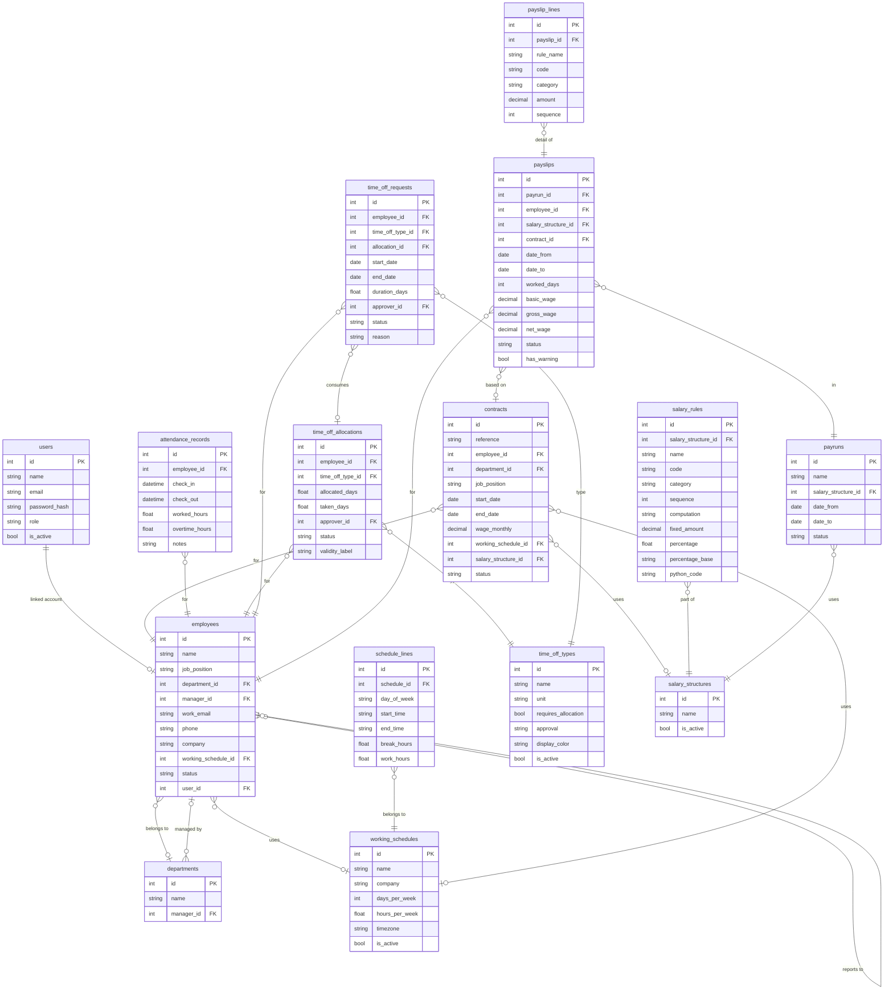

# DATABASE_SCHEMA.md — PeoplePay360 HR & Payroll

---

## Existing (Unchanged)

**Table: `users`** `EXISTING`

| Column | Type | Constraints |
|--------|------|-------------|
| `id` | INTEGER | PK, auto-increment, indexed |
| `name` | VARCHAR(255) | NOT NULL |
| `email` | VARCHAR(255) | NOT NULL, UNIQUE, indexed |
| `password_hash` | VARCHAR(255) | NOT NULL |

Auth: JWT stored as httpOnly cookie (`access_token`). Tokens decoded via `app.core.security.decode_access_token`. User resolved in `app.api.deps.get_current_user`.

---

## Additions

### Extension to `users` table `MODIFIED`

The `User` model needs a `role` column to implement role-based access control (RBAC). Roles determine which modules and records each user can see.

```python
# In app/models/user.py — ADD these columns to the existing User class

from sqlalchemy import String, Enum as SAEnum
import enum

class UserRole(str, enum.Enum):
    EMPLOYEE = "employee"
    HR_MANAGER = "hr_manager"
    HR_PAYROLL_USER = "hr_payroll_user"
    HR_PAYROLL_ADMIN = "hr_payroll_admin"
    ADMIN = "admin"

# Add to User class:
role: Mapped[str] = mapped_column(
    String(50),
    nullable=False,
    default=UserRole.EMPLOYEE,
    server_default=UserRole.EMPLOYEE.value,
)

is_active: Mapped[bool] = mapped_column(
    nullable=False,
    default=True,
    server_default="true",
)
```

**Alembic migration required:** Add `role VARCHAR(50) NOT NULL DEFAULT 'employee'` and `is_active BOOLEAN NOT NULL DEFAULT true` to `users`.

---

### NEW Table: `departments`

```python
# app/models/department.py
from sqlalchemy import String
from sqlalchemy.orm import Mapped, mapped_column, relationship
from app.core.database import Base

class Department(Base):
    __tablename__ = "departments"

    id: Mapped[int] = mapped_column(primary_key=True, index=True)
    name: Mapped[str] = mapped_column(String(255), nullable=False, unique=True)
    manager_id: Mapped[int | None] = mapped_column(ForeignKey("employees.id"), nullable=True)

    employees: Mapped[list["Employee"]] = relationship("Employee", back_populates="department", foreign_keys="Employee.department_id")
```

---

### NEW Table: `working_schedules`

```python
# app/models/working_schedule.py
from sqlalchemy import String, Float, Integer, Boolean
from sqlalchemy.orm import Mapped, mapped_column, relationship
from app.core.database import Base

class WorkingSchedule(Base):
    __tablename__ = "working_schedules"

    id: Mapped[int] = mapped_column(primary_key=True, index=True)
    name: Mapped[str] = mapped_column(String(255), nullable=False)
    company: Mapped[str] = mapped_column(String(255), nullable=False, default="My Company")
    days_per_week: Mapped[int] = mapped_column(Integer, nullable=False, default=5)
    hours_per_week: Mapped[float] = mapped_column(Float, nullable=False, default=40.0)
    timezone: Mapped[str] = mapped_column(String(100), nullable=False, default="Company timezone")
    is_active: Mapped[bool] = mapped_column(Boolean, nullable=False, default=True)

    schedule_lines: Mapped[list["ScheduleLine"]] = relationship("ScheduleLine", back_populates="schedule", cascade="all, delete-orphan")
```

### NEW Table: `schedule_lines`

```python
# app/models/working_schedule.py (same file)
from sqlalchemy import String, Float, ForeignKey, Time
from sqlalchemy.orm import Mapped, mapped_column, relationship

class ScheduleLine(Base):
    __tablename__ = "schedule_lines"

    id: Mapped[int] = mapped_column(primary_key=True, index=True)
    schedule_id: Mapped[int] = mapped_column(ForeignKey("working_schedules.id"), nullable=False, index=True)
    day_of_week: Mapped[str] = mapped_column(String(10), nullable=False)  # "Monday", "Tuesday", etc.
    start_time: Mapped[str] = mapped_column(String(10), nullable=False)   # "09:00"
    end_time: Mapped[str] = mapped_column(String(10), nullable=False)     # "18:00"
    break_hours: Mapped[float] = mapped_column(Float, nullable=False, default=1.0)
    work_hours: Mapped[float] = mapped_column(Float, nullable=False, default=8.0)

    schedule: Mapped["WorkingSchedule"] = relationship("WorkingSchedule", back_populates="schedule_lines")
```

---

### NEW Table: `employees`

```python
# app/models/employee.py
from sqlalchemy import String, ForeignKey, Boolean, Date
from sqlalchemy.orm import Mapped, mapped_column, relationship
from app.core.database import Base
import enum

class EmployeeStatus(str, enum.Enum):
    ACTIVE = "active"
    INACTIVE = "inactive"
    ARCHIVED = "archived"

class Employee(Base):
    __tablename__ = "employees"

    id: Mapped[int] = mapped_column(primary_key=True, index=True)
    name: Mapped[str] = mapped_column(String(255), nullable=False, index=True)
    job_position: Mapped[str | None] = mapped_column(String(255), nullable=True)
    department_id: Mapped[int | None] = mapped_column(ForeignKey("departments.id"), nullable=True, index=True)
    manager_id: Mapped[int | None] = mapped_column(ForeignKey("employees.id"), nullable=True)
    work_location: Mapped[str | None] = mapped_column(String(255), nullable=True)
    work_email: Mapped[str | None] = mapped_column(String(255), nullable=True, unique=True, index=True)
    phone: Mapped[str | None] = mapped_column(String(50), nullable=True)
    company: Mapped[str] = mapped_column(String(255), nullable=False, default="My Company")
    working_schedule_id: Mapped[int | None] = mapped_column(ForeignKey("working_schedules.id"), nullable=True)
    status: Mapped[str] = mapped_column(String(20), nullable=False, default=EmployeeStatus.ACTIVE)
    # user account link (optional — not every employee has a login)
    user_id: Mapped[int | None] = mapped_column(ForeignKey("users.id"), nullable=True, unique=True, index=True)
    # Private info
    date_of_birth: Mapped[Date | None] = mapped_column(nullable=True)
    private_address: Mapped[str | None] = mapped_column(String(512), nullable=True)

    department: Mapped["Department"] = relationship("Department", back_populates="employees", foreign_keys=[department_id])
    manager: Mapped["Employee | None"] = relationship("Employee", remote_side=[id], foreign_keys=[manager_id])
    working_schedule: Mapped["WorkingSchedule | None"] = relationship("WorkingSchedule")
    user: Mapped["User | None"] = relationship("User")
    contracts: Mapped[list["Contract"]] = relationship("Contract", back_populates="employee")
    attendance_records: Mapped[list["AttendanceRecord"]] = relationship("AttendanceRecord", back_populates="employee")
    time_off_requests: Mapped[list["TimeOffRequest"]] = relationship("TimeOffRequest", back_populates="employee")
    time_off_allocations: Mapped[list["TimeOffAllocation"]] = relationship("TimeOffAllocation", back_populates="employee")
```

---

### NEW Table: `contracts`

```python
# app/models/contract.py
from sqlalchemy import String, ForeignKey, Numeric, Date, Text
from sqlalchemy.orm import Mapped, mapped_column, relationship
from app.core.database import Base

class ContractStatus(str, enum.Enum):
    DRAFT = "draft"
    RUNNING = "running"
    EXPIRED = "expired"
    CANCELLED = "cancelled"

class Contract(Base):
    __tablename__ = "contracts"

    id: Mapped[int] = mapped_column(primary_key=True, index=True)
    reference: Mapped[str] = mapped_column(String(50), nullable=False, unique=True, index=True)  # e.g. CON/2026/0042
    employee_id: Mapped[int] = mapped_column(ForeignKey("employees.id"), nullable=False, index=True)
    department_id: Mapped[int | None] = mapped_column(ForeignKey("departments.id"), nullable=True)
    job_position: Mapped[str | None] = mapped_column(String(255), nullable=True)
    start_date: Mapped[Date] = mapped_column(nullable=False)
    end_date: Mapped[Date | None] = mapped_column(nullable=True)
    wage_monthly: Mapped[Decimal] = mapped_column(Numeric(12, 2), nullable=False)
    working_schedule_id: Mapped[int | None] = mapped_column(ForeignKey("working_schedules.id"), nullable=True)
    salary_structure_id: Mapped[int | None] = mapped_column(ForeignKey("salary_structures.id"), nullable=True)
    status: Mapped[str] = mapped_column(String(20), nullable=False, default=ContractStatus.DRAFT)
    notes: Mapped[str | None] = mapped_column(Text, nullable=True)

    employee: Mapped["Employee"] = relationship("Employee", back_populates="contracts")
    department: Mapped["Department | None"] = relationship("Department")
    working_schedule: Mapped["WorkingSchedule | None"] = relationship("WorkingSchedule")
    salary_structure: Mapped["SalaryStructure | None"] = relationship("SalaryStructure")
```

---

### NEW Table: `attendance_records`

```python
# app/models/attendance.py
from sqlalchemy import ForeignKey, Float, Text, DateTime
from sqlalchemy.orm import Mapped, mapped_column, relationship
from app.core.database import Base
from datetime import datetime

class AttendanceRecord(Base):
    __tablename__ = "attendance_records"

    id: Mapped[int] = mapped_column(primary_key=True, index=True)
    employee_id: Mapped[int] = mapped_column(ForeignKey("employees.id"), nullable=False, index=True)
    check_in: Mapped[datetime | None] = mapped_column(DateTime(timezone=True), nullable=True)
    check_out: Mapped[datetime | None] = mapped_column(DateTime(timezone=True), nullable=True)
    worked_hours: Mapped[float] = mapped_column(Float, nullable=False, default=0.0)
    overtime_hours: Mapped[float] = mapped_column(Float, nullable=False, default=0.0)
    notes: Mapped[str | None] = mapped_column(Text, nullable=True)

    employee: Mapped["Employee"] = relationship("Employee", back_populates="attendance_records")
```

---

### NEW Tables: `time_off_types`, `time_off_allocations`, `time_off_requests`

```python
# app/models/time_off.py
from sqlalchemy import String, ForeignKey, Integer, Float, Text, Date, Boolean
from sqlalchemy.orm import Mapped, mapped_column, relationship
from app.core.database import Base

class TimeOffType(Base):
    __tablename__ = "time_off_types"

    id: Mapped[int] = mapped_column(primary_key=True, index=True)
    name: Mapped[str] = mapped_column(String(255), nullable=False, unique=True)
    unit: Mapped[str] = mapped_column(String(20), nullable=False, default="days")  # "days" or "hours"
    requires_allocation: Mapped[bool] = mapped_column(Boolean, nullable=False, default=True)
    approval: Mapped[str] = mapped_column(String(20), nullable=False, default="manager")  # "manager" or "officer"
    display_color: Mapped[str | None] = mapped_column(String(30), nullable=True, default="blue")
    is_active: Mapped[bool] = mapped_column(Boolean, nullable=False, default=True)
    notes: Mapped[str | None] = mapped_column(Text, nullable=True)

class TimeOffAllocation(Base):
    __tablename__ = "time_off_allocations"

    id: Mapped[int] = mapped_column(primary_key=True, index=True)
    employee_id: Mapped[int] = mapped_column(ForeignKey("employees.id"), nullable=False, index=True)
    time_off_type_id: Mapped[int] = mapped_column(ForeignKey("time_off_types.id"), nullable=False, index=True)
    allocated_days: Mapped[float] = mapped_column(Float, nullable=False)
    taken_days: Mapped[float] = mapped_column(Float, nullable=False, default=0.0)
    approver_id: Mapped[int | None] = mapped_column(ForeignKey("employees.id"), nullable=True)
    status: Mapped[str] = mapped_column(String(20), nullable=False, default="to_approve")  # to_approve, approved, refused
    validity_label: Mapped[str | None] = mapped_column(String(100), nullable=True)  # e.g. "2026 Annual Balance"
    description: Mapped[str | None] = mapped_column(Text, nullable=True)

    employee: Mapped["Employee"] = relationship("Employee", back_populates="time_off_allocations", foreign_keys=[employee_id])
    time_off_type: Mapped["TimeOffType"] = relationship("TimeOffType")

class TimeOffRequest(Base):
    __tablename__ = "time_off_requests"

    id: Mapped[int] = mapped_column(primary_key=True, index=True)
    employee_id: Mapped[int] = mapped_column(ForeignKey("employees.id"), nullable=False, index=True)
    time_off_type_id: Mapped[int] = mapped_column(ForeignKey("time_off_types.id"), nullable=False, index=True)
    allocation_id: Mapped[int | None] = mapped_column(ForeignKey("time_off_allocations.id"), nullable=True)
    start_date: Mapped[Date] = mapped_column(nullable=False)
    end_date: Mapped[Date] = mapped_column(nullable=False)
    duration_days: Mapped[float] = mapped_column(Float, nullable=False)
    approver_id: Mapped[int | None] = mapped_column(ForeignKey("employees.id"), nullable=True)
    status: Mapped[str] = mapped_column(String(20), nullable=False, default="to_approve")  # to_approve, approved, refused
    reason: Mapped[str | None] = mapped_column(Text, nullable=True)

    employee: Mapped["Employee"] = relationship("Employee", back_populates="time_off_requests", foreign_keys=[employee_id])
    time_off_type: Mapped["TimeOffType"] = relationship("TimeOffType")
    allocation: Mapped["TimeOffAllocation | None"] = relationship("TimeOffAllocation")
```

---

### NEW Tables: `salary_structures`, `salary_rules`

```python
# app/models/payroll.py
from sqlalchemy import String, ForeignKey, Integer, Float, Text, Boolean, Numeric, Date, DateTime
from sqlalchemy.orm import Mapped, mapped_column, relationship
from app.core.database import Base
from datetime import datetime, date
from decimal import Decimal

class SalaryStructure(Base):
    __tablename__ = "salary_structures"

    id: Mapped[int] = mapped_column(primary_key=True, index=True)
    name: Mapped[str] = mapped_column(String(255), nullable=False, unique=True)
    is_active: Mapped[bool] = mapped_column(Boolean, nullable=False, default=True)
    notes: Mapped[str | None] = mapped_column(Text, nullable=True)

    salary_rules: Mapped[list["SalaryRule"]] = relationship("SalaryRule", back_populates="salary_structure", order_by="SalaryRule.sequence")

class SalaryRule(Base):
    __tablename__ = "salary_rules"

    id: Mapped[int] = mapped_column(primary_key=True, index=True)
    salary_structure_id: Mapped[int] = mapped_column(ForeignKey("salary_structures.id"), nullable=False, index=True)
    name: Mapped[str] = mapped_column(String(255), nullable=False)
    code: Mapped[str] = mapped_column(String(50), nullable=False)  # e.g. BASIC, HRA, PF
    category: Mapped[str] = mapped_column(String(50), nullable=False)  # basic, allowance, deduction, gross, net
    sequence: Mapped[int] = mapped_column(Integer, nullable=False, default=10)
    computation: Mapped[str] = mapped_column(String(20), nullable=False, default="fixed")  # fixed, percentage, python
    fixed_amount: Mapped[Decimal | None] = mapped_column(Numeric(12, 2), nullable=True)
    percentage: Mapped[float | None] = mapped_column(Float, nullable=True)
    percentage_base: Mapped[str | None] = mapped_column(String(50), nullable=True)  # e.g. "BASIC", "GROSS"
    python_code: Mapped[str | None] = mapped_column(Text, nullable=True)

    salary_structure: Mapped["SalaryStructure"] = relationship("SalaryStructure", back_populates="salary_rules")
```

---

### NEW Tables: `payruns`, `payslips`, `payslip_lines`

```python
# app/models/payroll.py (continued)

class PayrunStatus(str, enum.Enum):
    DRAFT = "draft"
    VALIDATED = "validated"
    PAID = "paid"

class Payrun(Base):
    __tablename__ = "payruns"

    id: Mapped[int] = mapped_column(primary_key=True, index=True)
    name: Mapped[str] = mapped_column(String(255), nullable=False)  # e.g. "February 2026"
    salary_structure_id: Mapped[int] = mapped_column(ForeignKey("salary_structures.id"), nullable=False)
    date_from: Mapped[date] = mapped_column(nullable=False)
    date_to: Mapped[date] = mapped_column(nullable=False)
    status: Mapped[str] = mapped_column(String(20), nullable=False, default=PayrunStatus.DRAFT)

    salary_structure: Mapped["SalaryStructure"] = relationship("SalaryStructure")
    payslips: Mapped[list["Payslip"]] = relationship("Payslip", back_populates="payrun")

class PayslipStatus(str, enum.Enum):
    DRAFT = "draft"
    DONE = "done"

class Payslip(Base):
    __tablename__ = "payslips"

    id: Mapped[int] = mapped_column(primary_key=True, index=True)
    payrun_id: Mapped[int] = mapped_column(ForeignKey("payruns.id"), nullable=False, index=True)
    employee_id: Mapped[int] = mapped_column(ForeignKey("employees.id"), nullable=False, index=True)
    salary_structure_id: Mapped[int] = mapped_column(ForeignKey("salary_structures.id"), nullable=False)
    contract_id: Mapped[int | None] = mapped_column(ForeignKey("contracts.id"), nullable=True)
    date_from: Mapped[date] = mapped_column(nullable=False)
    date_to: Mapped[date] = mapped_column(nullable=False)
    worked_days: Mapped[int] = mapped_column(Integer, nullable=False, default=0)
    basic_wage: Mapped[Decimal] = mapped_column(Numeric(12, 2), nullable=False, default=Decimal("0"))
    gross_wage: Mapped[Decimal] = mapped_column(Numeric(12, 2), nullable=False, default=Decimal("0"))
    net_wage: Mapped[Decimal] = mapped_column(Numeric(12, 2), nullable=False, default=Decimal("0"))
    status: Mapped[str] = mapped_column(String(20), nullable=False, default=PayslipStatus.DRAFT)
    has_warning: Mapped[bool] = mapped_column(Boolean, nullable=False, default=False)
    warning_message: Mapped[str | None] = mapped_column(String(500), nullable=True)

    payrun: Mapped["Payrun"] = relationship("Payrun", back_populates="payslips")
    employee: Mapped["Employee"] = relationship("Employee")
    contract: Mapped["Contract | None"] = relationship("Contract")
    lines: Mapped[list["PayslipLine"]] = relationship("PayslipLine", back_populates="payslip", order_by="PayslipLine.sequence")

class PayslipLine(Base):
    __tablename__ = "payslip_lines"

    id: Mapped[int] = mapped_column(primary_key=True, index=True)
    payslip_id: Mapped[int] = mapped_column(ForeignKey("payslips.id"), nullable=False, index=True)
    rule_name: Mapped[str] = mapped_column(String(255), nullable=False)
    code: Mapped[str] = mapped_column(String(50), nullable=False)
    category: Mapped[str] = mapped_column(String(50), nullable=False)
    amount: Mapped[Decimal] = mapped_column(Numeric(12, 2), nullable=False)
    sequence: Mapped[int] = mapped_column(Integer, nullable=False, default=10)

    payslip: Mapped["Payslip"] = relationship("Payslip", back_populates="lines")
```

---

## Alembic Migration Order

1. `role` + `is_active` columns on existing `users` table
2. `departments` (no FK dependencies beyond users)
3. `working_schedules` → `schedule_lines` (FK to working_schedules)
4. `employees` (FKs to departments, working_schedules, users)
5. Update `departments.manager_id` FK to employees (add separately after employees table exists)
6. `contracts` (FKs to employees, departments, working_schedules, salary_structures)
7. `salary_structures` → `salary_rules` (can go before contracts)
8. `attendance_records` (FK to employees)
9. `time_off_types` → `time_off_allocations` → `time_off_requests`
10. `payruns` → `payslips` → `payslip_lines`

**Practical approach:** Create one migration per phase, and add a `# noqa` import of all new models in `migrations/env.py` for each migration.

---

## ER Diagram


